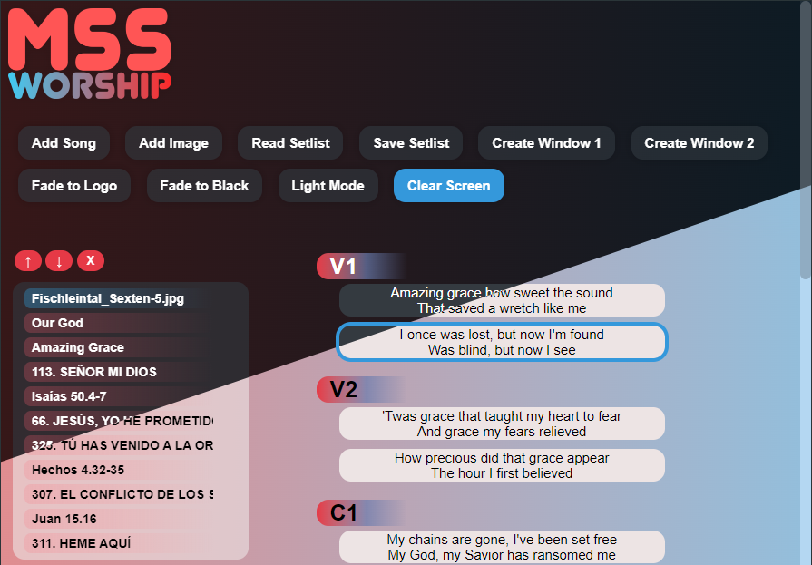

# New in 0.5.0!
v0.5.0 brings a graphic song editor, making the process more intuitive for those intimidated by editing the plain text files. However, the lyric file format will continue to be designed with easy manual editing in mind.

# MSS-Worship
An open-source Electron app for displaying song lyrics, images, and more, designed with worship in mind.

To learn how to write lyrics in MSS format with any plain text editor, or how to style lyrics / change the logo image, check out this repository's wiki.

### Warning:
Windows currently recognizes the installer as an "unsafe" and will trigger a warning pop-up. However, since the program is open-source and the installer does not compress the code into an asar file, it's easy to see that the program is in no way malicious. This will be fixed in a future update.

## Backstory
This project was born out of the need to project the lyrics to worship songs, along with images, passages, and other media, both with very large font, to be projected on a stage, and as captions for livestreamed services. Originally, the solution was to run a presentation software on two computers simultaneously, one for each use case, but due to a shortage of voulenteer staff, this proved difficult. 

Thus, the project was started with the following objectives in mind, and named after the church where it was concieved.

## Current Features
- Automatic text scaling with a configurable maximum font size
- Custom plain text lyric file format that allows for automatic section repetition
- Two separate projection windows, each fully and independently customizable via css
- Image projection (supported formats: jpeg, jpg, gif, png)
- A graphic song editor
- Ability to read an entire setlist from a folder
- Ability to write an entire setlist to a folder, preserving the order of its items

## Planned Features
- Video projection
- Native Bible verse projection

## Contributing to the project
#### I am by all means not an experienced programmer, but I plan to continually improve this app for years to come.
#### Any and all contributions to this project are much appreciated!
